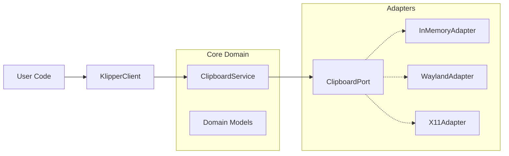

# Architecture Overview

Klipper SDK follows the **Hexagonal Architecture** (also known as Ports and Adapters). This ensures that the core business logic is isolated from external dependencies like the specific OS clipboard mechanism.

## High-Level Design

### Components

1.  **KlipperClient**: The public facade. It provides a user-friendly, async API. It does not contain business logic but delegatess to the Service.
2.  **ClipboardService**: The heart of the application. It orchestrates operations, validates data, and manages flows (like history).
3.  **ClipboardPort**: An abstract interface defining what a clipboard must do (`read`, `write`, `clear`, `history`).
4.  **Adapters**: Concrete implementations of `ClipboardPort` for different backends.

## Dependency Injection

We use Dependency Injection to wire these components. The `ClientFactory` (`src.klipper_sdk.factory`) handles this automatically for most users, but you can manually construct a `ClipboardService` with a custom adapter if needed.
